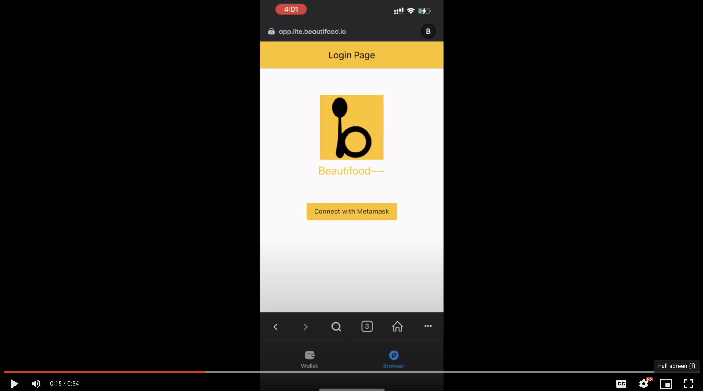

# **Beautifood**

## **Project Description**
A decentralised platform aiming to help merchants build their brand and digitalise their businesses with almost zero cost. Users without professional skills can get onboard easily while they can also make their own highly customised solution with Beautifood. From features such as Point of Sales (POS), QR ordering, to advertising their shop, and even membership and loyalty system, Beautifood is all you need to start a digital F&B business.

## **How it's Made**

## **Pitch deck**
https://app.pitch.com/app/presentation/bbd5bbbb-e84c-4d3e-a025-4587cf7c7b39/714ab5ba-b821-4838-a1f9-9f7a80827644/9b5c0af3-c1e7-4d1e-a142-f8b3f6c1f44c
# **Demo** 
[](https://drive.google.com/file/d/1tcfQpTP_9ZhrhMnwHJg_UfCMJ3lS-_KO/view)
https://pitch.com/public/714ab5ba-b821-4838-a1f9-9f7a80827644

## **Architecture**
[TODO]
## **Deployments on zetachain**

Contract | Network | Address
--- | --- | --- |
BeautifoodZeta | Athens | 0xE928a5e0f387FcF07f8C21F3a419c9F082EcE09A
Beautifood | Goerli | 0xE928a5e0f387FcF07f8C21F3a419c9F082EcE09A

# **How to run  (Integration)**

### 1. In `./nodes/node2` folder :
```bash
chmod 755 run.sh && ./run.sh
```
The RPC is `http://0.0.0.0:8565/`


### 1. In `./contracts` folder :

```bash
cp env.example .env # fill in with private keys
```
```bash
yarn install
```
```bash
yarn compile
```
```bash
yarn deploy --network l2
```

this will :
- this will deploy a contract for beautifood
- this will give assets to account 2
- this will submit a menu for store with address equal to account 1
- this will mint tokens for account 2
- this will make an order from account 2 to account 1 (store)

details for accounts with private keys : will send in DM

# **Team**

Carlos Ramos

_Full-stack Developer_
